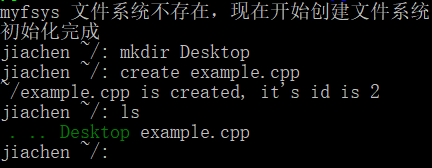
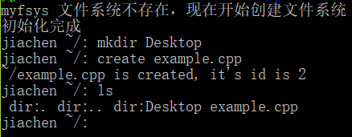

# 杭州电子科技大学操作系统课程设计：简单文件系统的实现

*如有需要，欢迎自行取用，但是不建议你拿着这个代码去验收，自己的知识永远是自己的，好好学习才是王道！*

代码为文件`SimpleFS.c`，可以直接运行，每个函数都写好了注释（本来是想用不同的文件写不同的代码，这样代码之间的组织结构更清晰，但是自己还是太菜了，c之间的多文件的结构太伤人脑筋，如果以后有空我再重新组织组织），几天后我会写一个相关的文档，方便他人理解代码以及更好地完成课程设计。

2017版本的文件系统实验说明并没有很系统地说明需要学生完成的任务，特别是有些细节没有说清会让人产生误解（而且有些函数根本不是哪里都可以调用的好吧嘤嘤嘤），自己和老师说了很多课程设计中不合理的地方，但是老师只是笑了一笑…………

**如果有疑问（特别是发现了代码的bug！），欢迎给我发邮件（yjc567@foxmail.com），或者直接在此repo中添加issue。**

如果你使用的是Linux系统，请把代码第8行的`#define OS_WINDOWS`改为`#define OS_LINUX`，这样文件夹在终端中会显示为绿色（其实你可以给各种字段加上各种颜色，但是我累了，改不动了，如果有人想改还希望fork一下）。如图:

否则只有一个`dir`的提示符提示这个是一个目录文件夹。如图：

## TODO：

以后可以改进的地方

1. 选择在一个父目录下添加fcb时，应该选择其磁盘上第一个空闲的fcb块作为新添加fcb的位置，以增大磁盘的利用率，本代码因为时间匆忙，不在细节上做过多的优化（sjt说可以删除fcb的时候，把空闲出的位置用最后一个fcb块填充，同时把父目录fcb的length减去sizeof fcb，这样可以充分利用fat的空间，不知道实际的fat系统是否是这样做的）
2. fcb的data和time两个成员变量应该是记录一个文件的创建时间的（按理说应该还有文件的最新更新时间也要记录）因为实验要求里的逻辑无法验证这两个变量是否存在，为了缩短编程的时间，没有任何与这两个成员变量相关的操作
3. fcb的exname成员变量记录的是文件的后缀名，与2同理，实验要求里的逻辑无法验证这个变量是否存在（因为可以把文件名加上后缀名一起作为文件名），所以代码里目前也没有与这个成员变量相关的操作（验收的时候老师竟然自己都清楚这个问题，根本不问我后缀名的事情！）
4. main里面其实就是一个读入命令和参数，然后执行相关命令的过程，所以应该一次直接读入一行，然后判断里面的命令和参数是否合法，但自己的写法没有判断换行（因为这样有点小烦……），有时会导致错误的发生
5. 代码应该尽量抽象，使用更多的c高级语法，以降低后期的维护成本（当然我验收完就不会用这个代码了 :) ）
6. 有一个遍历文件夹的内容的代码重复了5次（也许是6次），但是每次需要做的事情都不一样，所以需要利用函数指针来避免代码重复
7. 代码里有太多错误提示了，在代码逐渐完善后，不如把错误提示全去了，要是真的崩溃了，就让程序崩溃把（py还好，感觉c这样写真的药丸）

