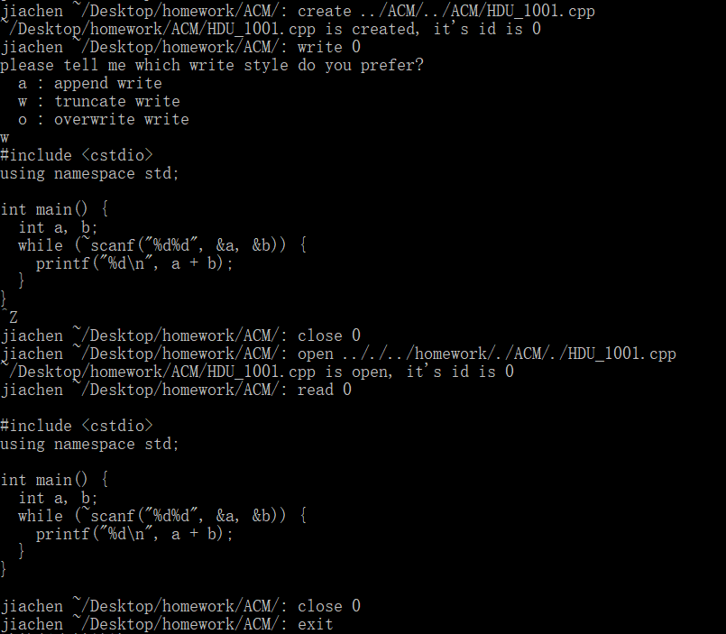

# 杭州电子科技大学操作系统课程设计：简单文件系统的实现

欢迎自行取用，代码可以运行，但是函数的布局并不适合阅读和后期维护，几天后我会根据函数之间的依赖重新组织一下代码，并写成相关的文档，方便他人理解代码以及更好地完成课程设计。

推荐自己独立完成代码，并推荐使用Visual Studio作为IDE（CLion应该也适合写这种较大型的代码）。

2017版本的文件系统实验说明并没有很系统地说明需要学生完成的任务，特别是有些细节没有说清会让人产生误解，如果自己接下来还有剩余时间的话，会写一些相关的说明，并建议老师修改一下实验说明。

**如果有疑问（特别是发现了代码的bug！），欢迎给我发邮件（yjc567@foxmail.com），或者直接在此repo中添加issue。**

这些文件是Visual Studio 2017工程的一部分，需要包含的头文件在stdafx.h中，宏定义和各种定义部分在JCFS.h中，具体的实现在JCFS.cpp中，虽然这里都是cpp代码（因为我的Visual Studio只安装了c++的相关工程配置，而我又不是想把太多时间浪费在IDE上），但是代码中应该只使用了c的语法。

## TODO：

以后可以改进的地方

1. 选择在一个父目录下添加fcb时，应该选择其磁盘上第一个空闲的fcb块作为新添加fcb的位置，以增大磁盘的利用率，本代码因为时间匆忙，不在细节上做过多的优化（sjt说可以删除fcb的时候，把空闲出的位置用最后一个fcb块填充，同时把父目录fcb的length减去sizeof fcb，这样可以充分利用fat的空间，不知道实际的fat系统是否是这样做的）
2. fcb的data和time两个成员变量应该是记录一个文件的创建时间的（按理说应该还有文件的最新更新时间也要记录）因为实验要求里的逻辑无法验证这两个变量是否存在，为了缩短编程的时间，没有任何与这两个成员变量相关的操作
3. fcb的exname成员变量记录的是文件的后缀名，与2同理，实验要求里的逻辑无法验证这个变量是否存在（因为可以把文件名加上后缀名一起作为文件名），所以代码里目前也没有与这个成员变量相关的操作
4. main里面其实就是一个读入命令和参数，然后执行相关命令的过程，所以应该一次直接读入一行，然后判断里面的命令和参数是否合法，但自己的写法没有判断换行，有时会导致错误的发生
5. 代码应该尽量抽象，使用更多的c高级语法（虽然这个文件是cpp文件，但是里面按某种理由来说，应该不能出现任何c++语法），以降低后期的维护成本（当然我验收完就不会用这个代码了 :) ）
6. 有一个遍历文件夹的内容的代码重复了5次（也许是6次），但是每次需要做的事情都不一样，所以需要利用函数指针来避免代码重复
7. 代码里有太多错误提示了，在代码逐渐完善后，不如把错误提示全去了，要是真的崩溃了，就让程序崩溃把（py还好，感觉c这样写真的药丸）

## 代码运行结果

见下图，感觉自己的测试数据已经够乱来和暴力了 = =

